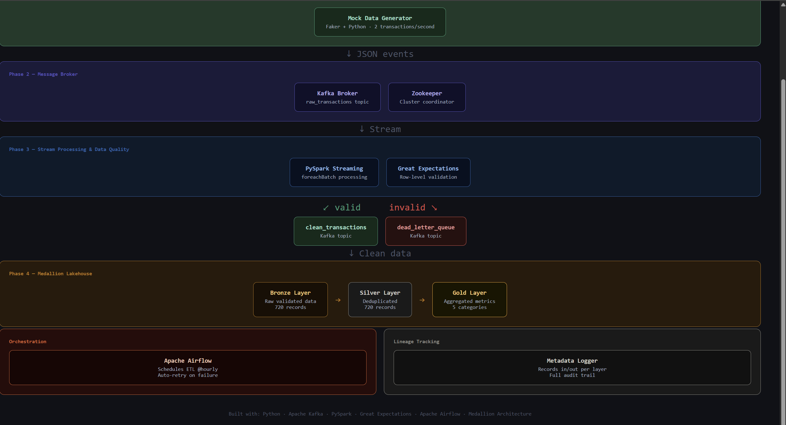
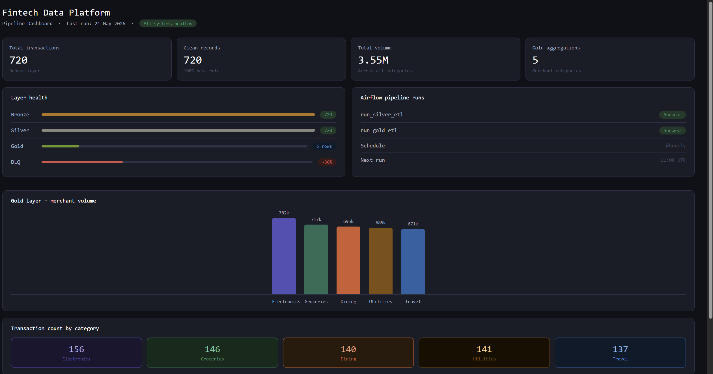

# Fintech Data Platform

A portfolio-grade end-to-end real-time data engineering pipeline that processes,
validates and stores streaming financial transactions using a Medallion Lakehouse
architecture.

---

## Architecture

The pipeline is broken into four phases:

- Phase 1 — Mock data generator produces fake financial transactions
- Phase 2 — Apache Kafka receives and queues all transactions
- Phase 3 — PySpark and Great Expectations validates and routes records
- Phase 4 — Medallion Lakehouse stores Bronze, Silver and Gold layers
---

## Tech Stack

- Infrastructure: Docker and Docker Compose
- Message Broker: Apache Kafka and Zookeeper
- Stream Processing: PySpark Structured Streaming
- Data Quality: Great Expectations
- Orchestration: Apache Airflow
- Storage: Medallion Lakehouse Bronze Silver Gold
- Lineage Tracking: Custom Metadata Logger

---

## Medallion Architecture

| Layer | Description | Records |
|---|---|---|
| Bronze | Raw validated transactions | 720 |
| Silver | Deduplicated records | 720 |
| Gold | Aggregated merchant metrics | 5 rows |
---

## Project Structure

fintech-data-platform/
├── docker-compose.yml
├── requirements.txt
├── README.md
├── src/
│   ├── generator/
│   │   └── generator.py
│   ├── streaming/
│   │   └── streaming_job.py
│   └── lakehouse/
│       ├── bronze_ingestion.py
│       ├── silver_gold_etl.py
│       └── metadata_logger.py
└── images/
    ├── architecture.html
    └── dashboard.html

---

## How to Run

1. Start Infrastructure
docker compose up -d

2. Start the Generator
python src/generator/generator.py

3. Start the Validator
python src/streaming/streaming_job.py

4. Start Bronze Ingestion
python src/lakehouse/bronze_ingestion.py

5. Run Silver and Gold ETL
python src/lakehouse/silver_gold_etl.py

6. Start Airflow
export AIRFLOW_HOME=~/airflow
airflow scheduler
airflow webserver --port 8080

---

## Key Features

- Real-time data generation with Faker
- Stream validation routing valid and invalid records
- Bronze Silver Gold medallion lakehouse
- Apache Airflow scheduling ETL every hour
- Metadata lineage tracking per pipeline run

---

## Next Steps

- Connect to AWS S3 for cloud storage
- Add MinIO for local S3-compatible storage
- Integrate DataHub for full data lineage

---

## Author

Zainab Olubuade — Data Engineering Portfolio Project

